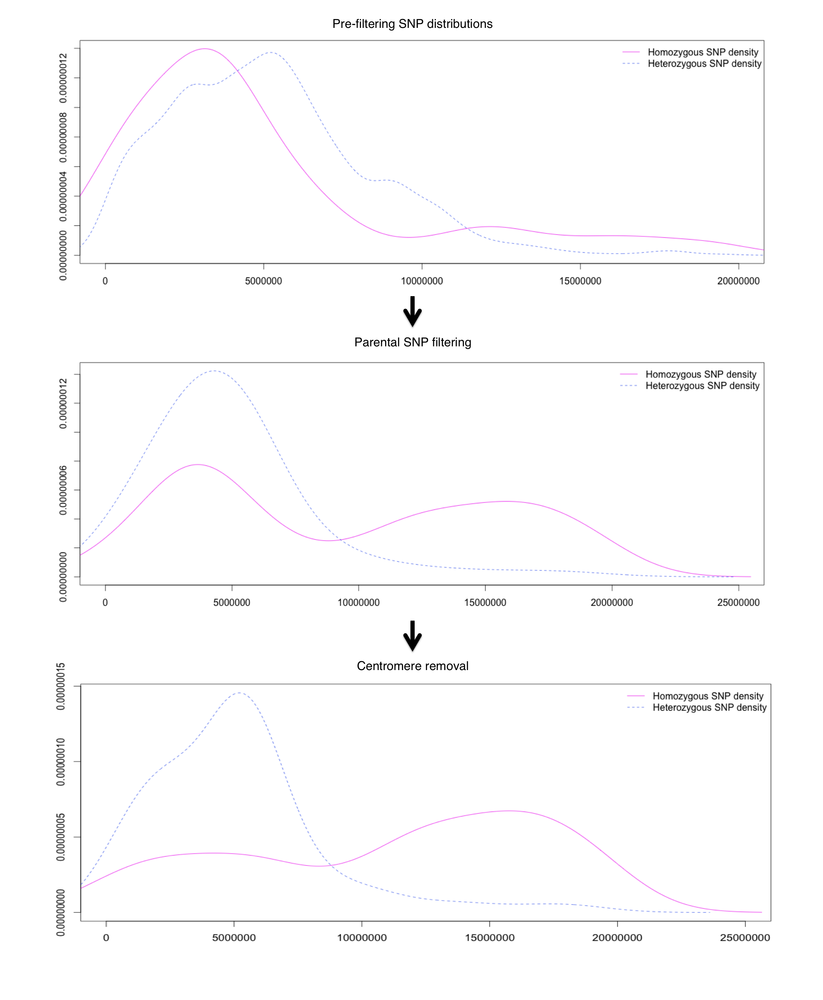

Additional figures
===

**Additional figure 1** Standard pipeline for sequence alignment and SNP calling in forward genetics screens in *Arabipdopsis thaliana* 

**Additional figure 2** Differences in the homozygous to heterozygous SNP ratio by adding a different factor (1, 0.1 and 0.0.1) to numerator and denominator. 

**Additional figure 3** Importance of filtering step. Homozygous SNP distribution before filtering, after background SNPs filtering and after centromere removal.
