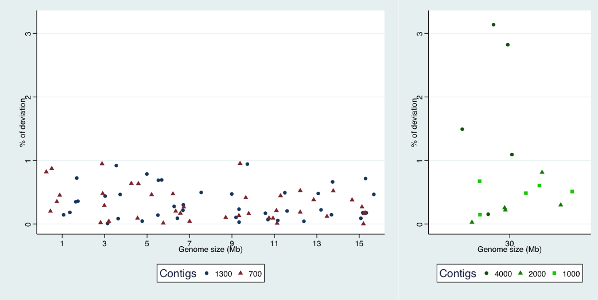
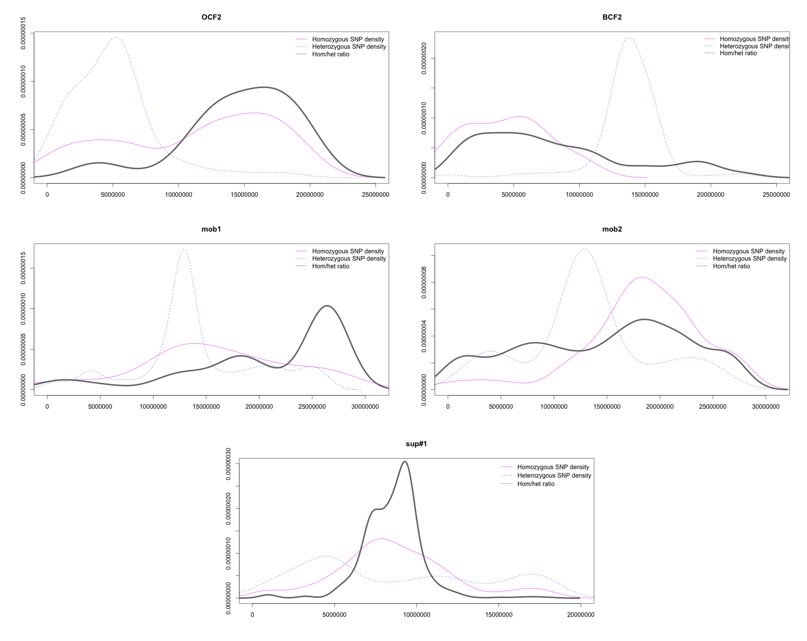
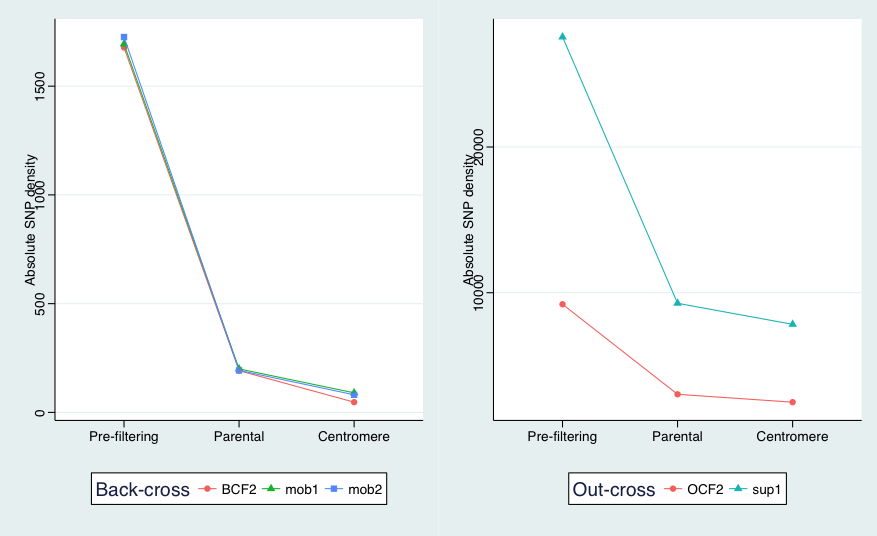

**Figure 1** - SDM workflow-

**Figure 2** -deviation-

**Figure 3** -ratio filtering step-

**Figure 4** -densities-

**Figure 5** -qqplots-

**Figure 6** -contig size analysis-

**Figure 7** -SNP density analysis-

**Figure 8** -ratios after SDM- 

