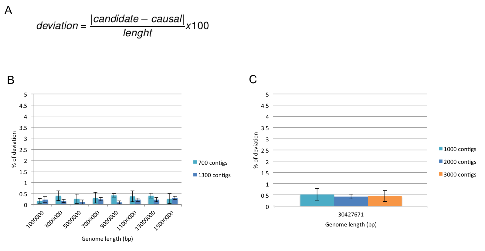
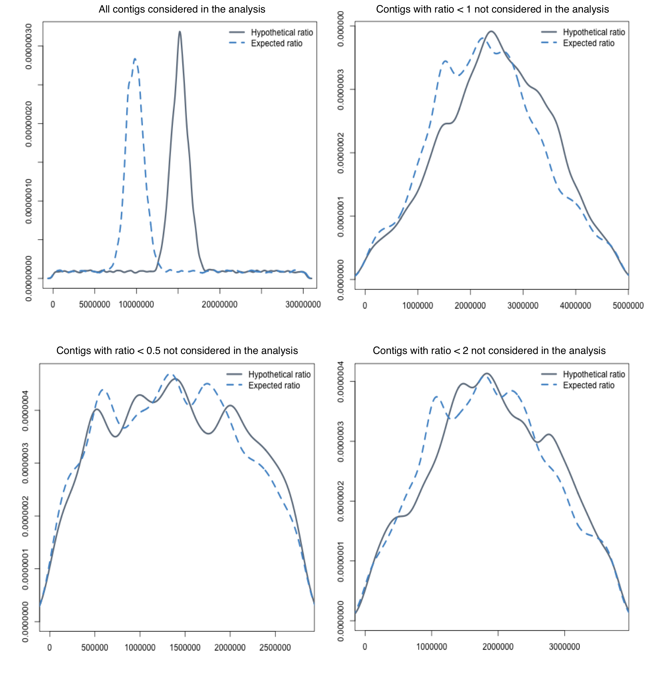
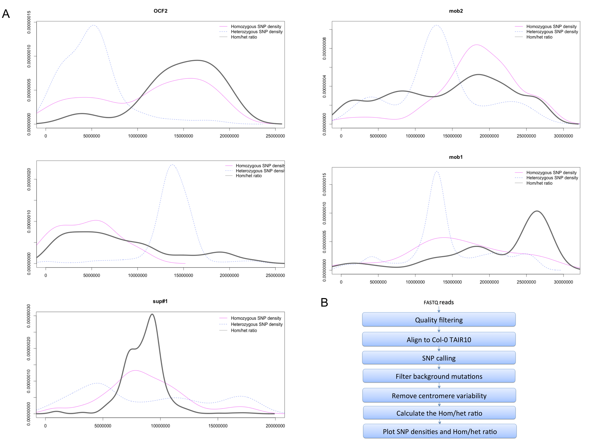
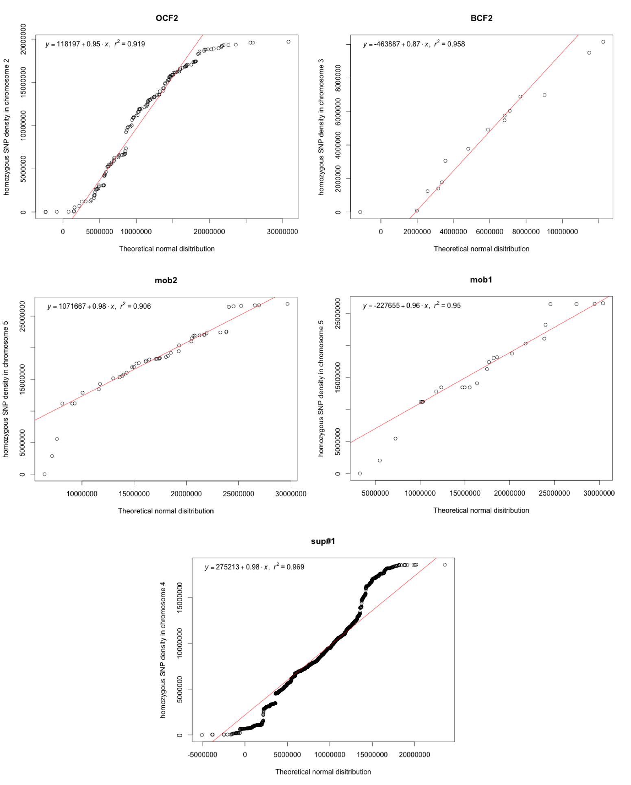
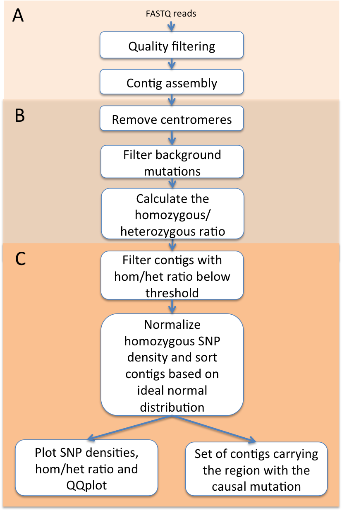
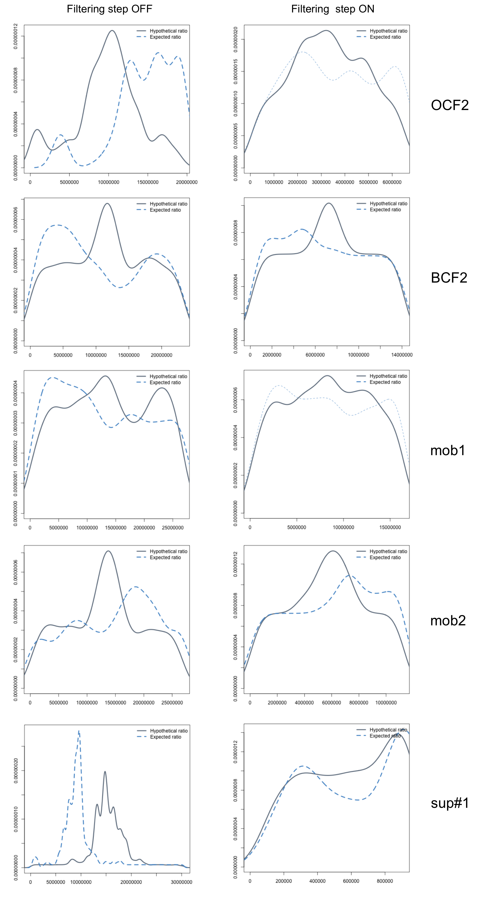
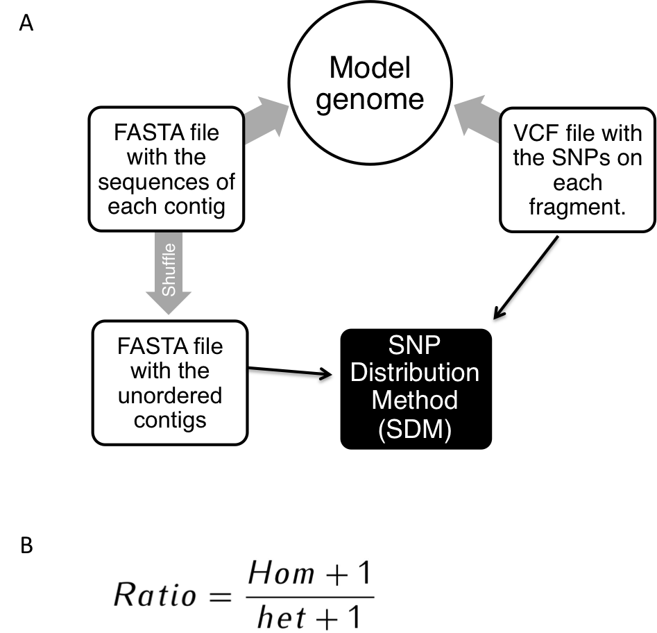
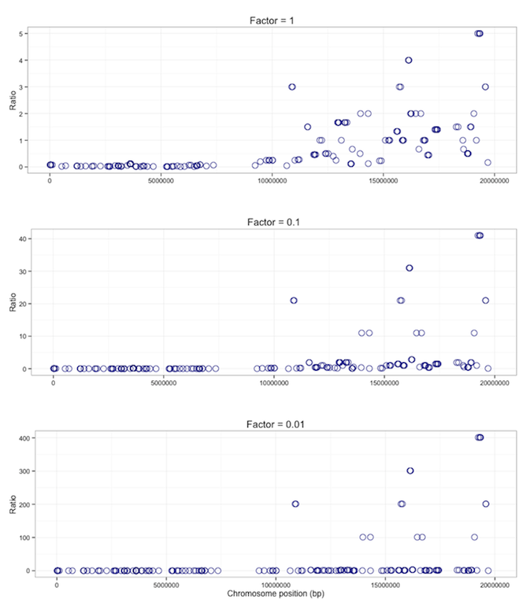
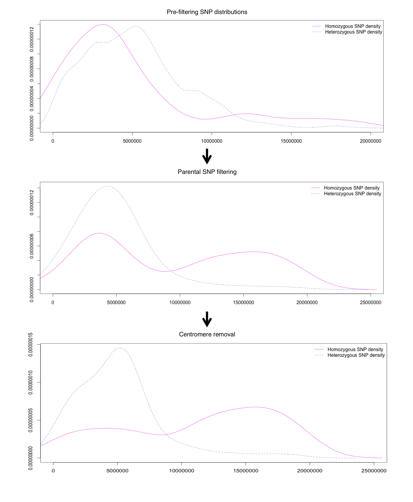
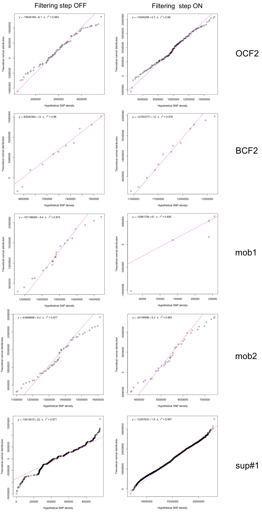

**Figure 1.** SDM percentage of deviation from expected location of the causal mutation. **(A)** The deviation is a measure of the difference between the expected mutation position and the candidate position predicted by SDM normalised by the model genome lenght. **(B)** 5 replicates of each model genome were created and results are shown as mean ± SD.  Genome size range from 1 to 15 Mb and two contig sizes were also analysed (approximately 700 contigs in light blue and 1300 contigs in dark blue). **(C)** 5 replicates of each model genome were created and results are shown as mean ± SD. The whole chromosome I from *Arabidopsis* was used as a model genome and three contig sizes were analysed (approximately 1000 contigs in light blue, 2000 contigs in dark blue and 3000 contigs in orange)

**Figure 2.** Importance of filtering step based on Hom/het ratio in model genomes. The expected ratio was measured in the corretly ordered fragments. The hypothetical ratio was measured in the post SDM contig order.  

**Figure 3.** Identification of high homozygous SNP density peaks surrounding the causal mutation in 5 independent studies. **(A)** Overlapping homozygous, heterozygous SNP densities and ratios for OCF2, BCF2, bak1-5 mob1/mob2 and sup#1 **(B)** Standard pipeline for sequence alignment and SNP calling in forward genetics screens in *Arabipdopsis thaliana*.

**Figure 4.** Measurement of the correlation of the homozygous SNP density to a normal distribution in back-cross and out-cross experiments by probability (Q-Q) plots. Simple linear regression was used to determine the relationship.

**Figure 5.** Simplified pipeline for mutant identification by SDM from sequencing reads. **(A)** Prior to running SDM. FastQ reads are subjected to a quality filtering step followed by a simple reference independent contig assembly. **(B)** SDM pre-filtering step to remove centromeric variability and parental mutations. Hom/het ratios are calculated. **(C)** SDM workflow. If required, contigs with a ratio below the threshold (25% of the maximum ratio) are not further considered in the analysis. Contig sorting based on normalised homozygous SNP density and plotting. 

**Figure 6.** Identification by SDM of genomic regions carrying causal mutations for 5 different and independent mutants (OCF2, BCF2, bak1-5 mob1/mob2 and sup#1). The expected ratio was measured in the corretly ordered fragments. The hypothetical ratio was measured in the post SDM contig order. Programme was run twice with and without pre-filtering step. 

**Figure 1**

**Figure 2**

**Figure 3**

**Figure 4**

**Figure 5**

**Figure 6**

#Additional figures

**Additional figure 1** (A) Simplified diagram of model genome creation. (B) The homozygous to heterozygous SNP ratio is calculated by fragment. The absolute number of homozygous SNPs in a fragment plus 1 are divided by the absolute number of heterozygous SNPs in the same fragment. 

**Additional figure 2** Differences in the Hom/het ratio density by adding a different factor (1, 0.1 and 0.0.1) to numerator and denominator. 

**Additional figure 3** Change in the homozygous SNP density plot before filtering, after background SNPs filtering and centromere removal.

**Additional figure 4** Recovery of SNP density correlation to normal after SDM for 5 different and independent mutants (OCF2, BCF2, bak1-5 mob1/mob2 and sup#1). Simple linear regression was used to determine the relationship. Programme was run twice with and without pre-filtering step. 

**Additional figure 1.** 

**Additional figure 2** 

 **Additional figure 3** 

**Additional figure 4** 

