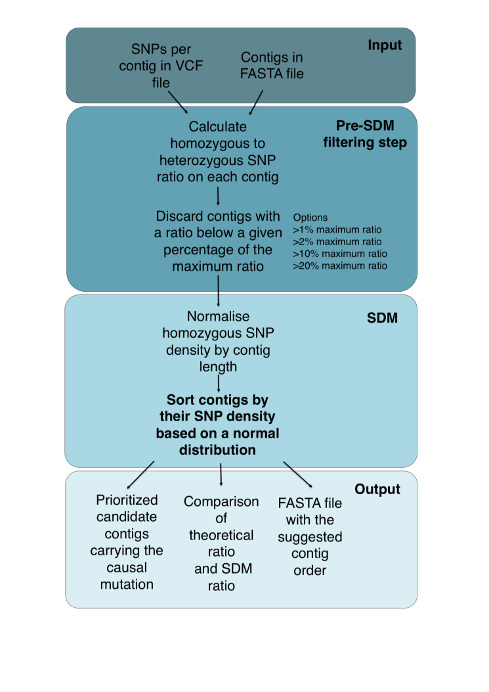
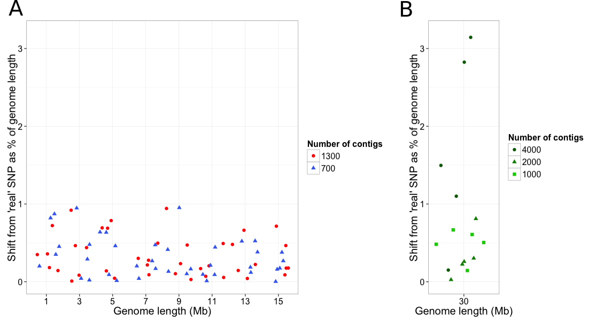
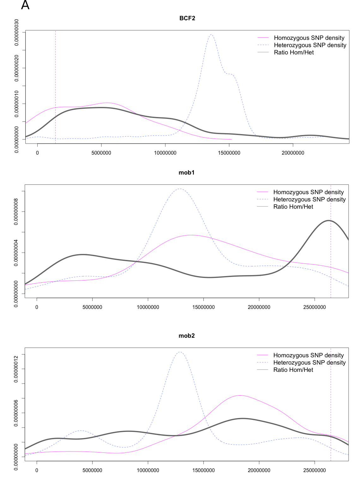
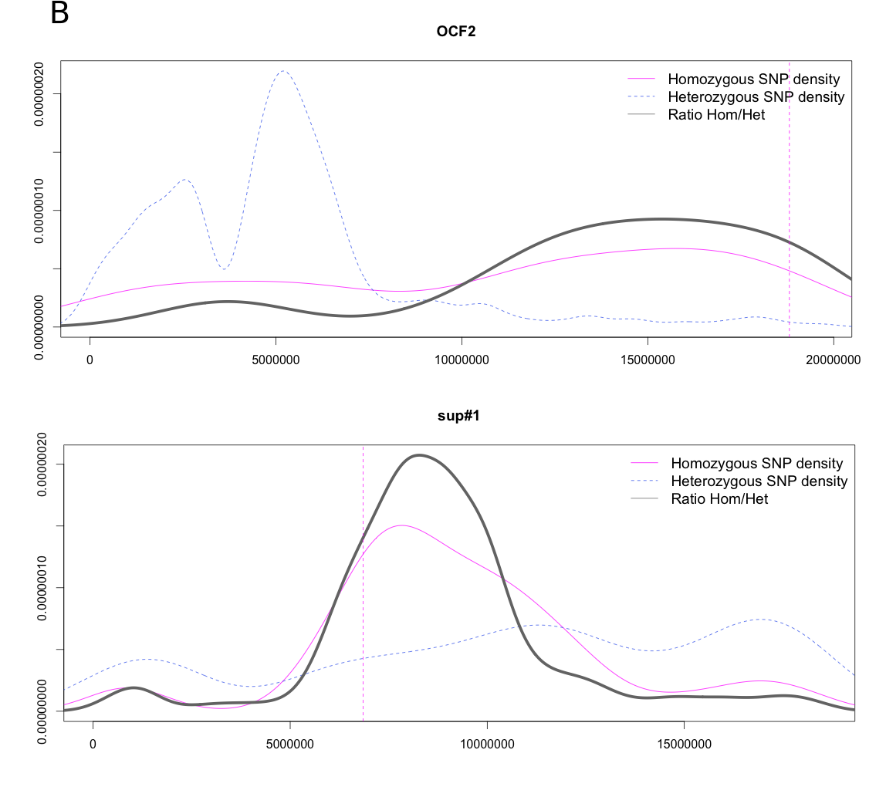
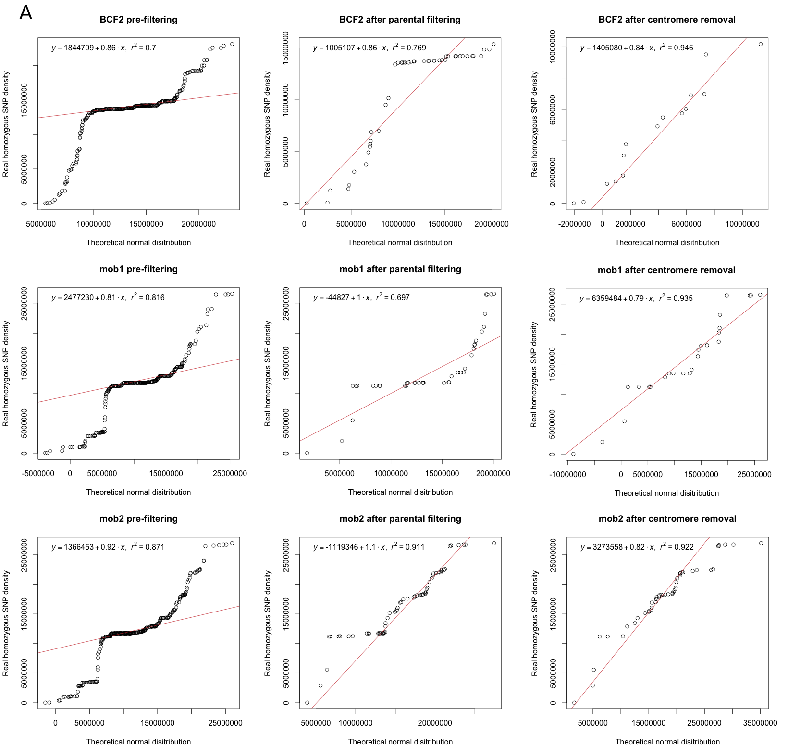

Figures
===

**Figure 1.** SDM workflow. 

**Figure 2.** SDM percentage of deviation from the causative mutation expected location in the model genomes. The deviation is a measure of the difference between the expected mutation position and the candidate position predicted by SDM normalised by the model genome length. 5 replicates of each model genome were created. **(A)** Genome size range from 1 to 15 Mb with two contig sizes (700  and 1300 contigs). **(B)** Whole-sized *Arabidopsis thaliana* chromosome 1 with three contig sizes (4000, 2000 and 1000 bp)

**Figure 3.** Effect of a pre-filtering step based on the homozygous to heterozygous SNP ratio in model genomes. The ratio is calculated by contig and those contigs falling below a given percentage of the maximum ratio are discarded. The expected ratio was measured in the corretly ordered fragments. Thge SDM ratio was measured after SDM sorting. **(A)**  1% of the maximum ratio. **(B)** 5% of the maximum ratio. **(C)** 10% of the maximum ratio. **(D)** 20% of the maximum ratio.

**Figure 4.**. Absolute number of homozygous SNPs before and after filtering in independent **(A)** back-crossed and **(B)** out-crossed populations. The final candidate positions after running SDM were also compared in the **(C)** back-crossed and **(D)** out-crossed populations.

**Figure 5.** Identification of high homozygous SNP density peaks surrounding the causal mutation in 5 independent studies. Overlapping homozygous and heterozygous SNP densities and hom/het ratios for OCF2, BCF2, bak1-5 mob1/mob2 and sup#1.

**Figure 6.** Measurement of the homozygous SNP density correlation to a normal distribution in back-crossed and out-crossed populations by probability (Q-Q) plots. Simple linear regression was used to verify the correlation.
 
**Figure 7.** Analysis of average contig size in different whole genome assemblie. **(A)** N50 contig size vs Genome size in 29 whole genome assemblies at contig level. Colour represents the sequencing technology or the combination of sequencing technologies used.  **(B)** N50 contig size distribution for Illumina HiSeq (pink) and the other sequecing technologies (blue). Medians are represented by the dashed lines. **(C)** Model for the non-linear relationship between N50 contig size and genome size in Illumina HiSeq assemblies

\begin{center}
Figure 1 
\end{center}

\newpage

\begin{center}
Figure 2 
\end{center}

\newpage

\begin{center}
Figure 3 
\end{center}

\newpage

\begin{center}
Figure 4 
\end{center}

\newpage 

\begin{center}
Figure 5
\end{center}

\newpage

\begin{center}
Figure 5
\end{center}

\newpage

\begin{center}
Figure 6
\end{center}

\newpage

\begin{center}
Figure 6
\end{center}

\newpage

\begin{center}
Figure 7
\end{center}

\newpage

\begin{center}
Figure 7
\end{center}

\newpage

