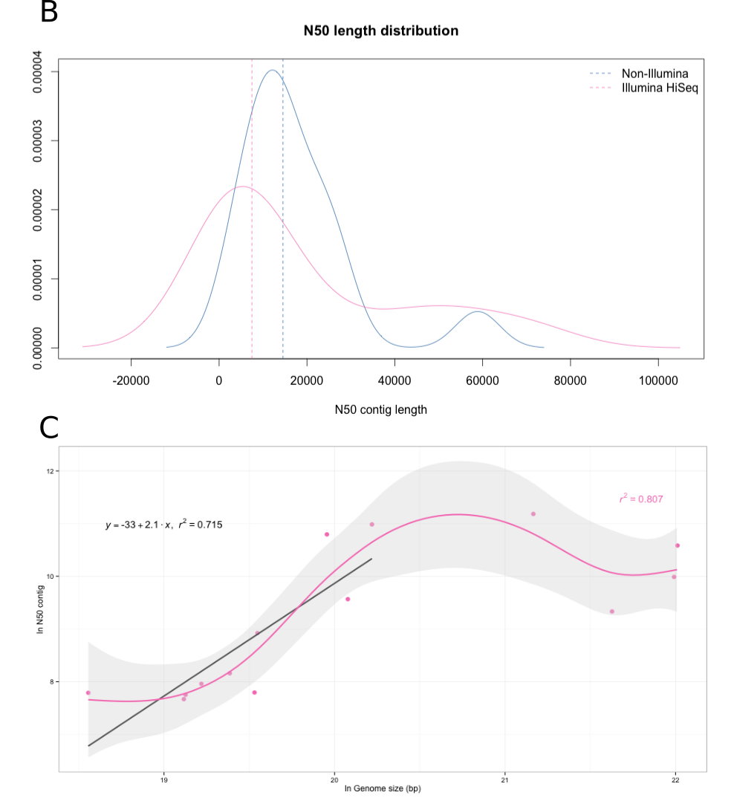

---
title: "Identification of genomic regions carrying a causal mutation in unordered genomes"
author: Pilar Corredor-Moreno
date: September 2015
abstract: Whole genome sequencing using high-throughput sequencing (HTS) technologies offers powerful opportunities to study genetic variation. Mapping the mutations responsible for different phenotypes is generally an involved and time-consuming process so researchers have developed user-friendly tools for mapping-by-sequencing, yet they are not applicable to organisms with non-sequenced genomes. We introduce SDM (SNP Distribution Method), a reference independent method for rapid discovery of mutagen-induced mutations in typical forward genetics screens. SDM aims to order a disordered collection of HTS reads or contigs such that the fragment carrying the causative mutations can be identified. SDM uses typical distributions of homozygous SNPs that are linked to a phenotype-altering SNP in a non-recombinant region as a model to order the fragments. To implement and test SDM, we created model genomes with SNP density based on *Arabidopsis thaliana* chromosome 1 and analysed fragments with size distribution similar to reads or contigs assembled from HTS sequencing experiments. SDM groups the contigs by their normalised SNP density and arranges them to maximise the fit to the expected SNP distribution. We analysed the procedure in existing data sets by examining SNP distribution in recent out-cross [17, 18] and back-cross experiments [19, 20] in *Arabidopsis thaliana* backgrounds. In all the examples we analysed, homozygous SNPs were normally distributed around the causal mutation. We used the real SNP densities obtained from these experiments to prove the efficiency and accuracy of SDM. The algorithm could successfully identify small sized (10-100 kb) genomic regions containing the causative mutation.
...

1. Background 
===

Forward genetic screens have been a fundamental strategy to find genes involved in biological pathways in model species. In these a population is treated with a mutagen that alters the DNA of individuals in some way, e.g. induction of guanine-to-adenine substitutions using ethylmethane sulfonate (EMS) [1]. Individuals with a phenotype of interest are then isolated from a mutagenised population and a recombinant mapping population is created by back-crossing to the parental line or out-crossing to a polymorphic ecotype [2]. The recombinant population obtained from that cross will segregate for the mutant phenotype and individuals showing the mutant phenotype will carry the causal mutation, even if the genomic location is unknown. The recombination frequency between the causal mutation and nearby genetic markers is low, so the alleles of these linked genetic markers will co-segregate with the phenotype-altering mutation while the remaining unlinked makers segregate randomly in the genome [3].

Hence, the analysis of the allele distribution can uncover these low recombinant regions to identify the location of the causal mutation. This genetic analysis is often referred to as bulked-segregant analysis (BSA) [4]. Traditional genetic mapping is a work intensive and time-consuming process but recent advances in high-throughput sequencing (HTS) have greatly accelerated the identification of mutations underlying mutant phenotypes in forward genetic screens. Several methods such as  CandiSNP [2], SHOREmap [5,6] or NGM [7] based on bulked-segregant analysis of F2 progeny have successfully identified mutants in *Arabidopsis thaliana*. However, all these methods depend on an assembled reference genome and cannot be used in species for which a reference genome is not available. Some alternative solutions using reference sequences of related species have been proposed [8, 9], but these require low sequence divergence and high levels of synteny between the mutant reads and the related reference sequence and this has restained the application of these approaches [3,10]. Substantial effort is being made to sequence many species but reasonable completion of a sequence remains expensive and time-consuming, and fragmented draft genomes present certain limitations in use for mutation mapping in many circumstances. Fast-evolving and repetitive genes such as disease resistance genes [11] might be absent or divergent from draft reference genome assemblies. Also, draft genomes often contain gaps that can frustrate alignments. In the last few years, several reference-free methods for general mutation identification have been proposed [10, 12, 13, 14] to solve the reference sequence restriction, but none have been extended to allow for direct identification of causative mutations [3, 14, 15].

We propose SDM, a fast causative mutant identification method based on contigs or reads that allows the detection of candidate causative SNPs. Instead of relying on a genome comparison, we focus on the SNP linkage around the causal mutation and analyse the SNP distribution to identify the chromosome area where the putative mutated gene is located. SDM does not rely on previously known genetic markers and can be used on extremely fragmented genome assemblies, even down to the level of long reads.

2. Methods
===

###2.1. Model genome generation

We used model genomes to develop our mutant identification method. We assigned an idealised SNP distribution to a set of randomly shuffled sequences that imitate contigs assembled from HTS. We created different model genomes based on _Arabidopsis thaliana_ chromosome 1 [(TAIR10_chr1.fas, 34.9 Mb)](ftp://ftp.arabidopsis.org/home/tair/home/tair/Sequences/whole_chromosomes) from [The Arabidopsis Information Resource](https://www.arabidopsis.org/index.jsp) [16]. *Arabidopsis thaliana* makes an ideal model genome due to its small size, a well-described genetic variation and a small content of repeats.

To generate the model genomes, we used different variations of the script [https://github.com/edwardchalstrey1/fragmented_genome_with_snps/blob/master/create_model_genome.rb](https://github.com/edwardchalstrey1/fragmented_genome_with_snps/blob/master/create_model_genome.rb).  A detailed protocol and the code to replicate the model genomes were deposited in a GitHub repository at [https://github.com/pilarcormo/SNP_distribution_method/tree/master/Small_genomes](https://github.com/pilarcormo/SNP_distribution_method/tree/master/Small_genomes). 

Homozygous SNPs followed a normal distribution (as proven in the section 3.4). The R function `rnorm` defined by `n`, `mean` and `sd` was used to describe the homozygous SNP distribution. The mean was specified in the middle of the model genome, generating a normal distribution with equally sized tails. The standard deviation (sd) was 2 times the mean value. Heterzygous SNPs followed a uniform distribution across the genome length. The R function `runif` defined by `n`, `min` and `max` was used to describe the heterozygous SNPs. The `min` value was fixed to 1 and the `max` value was the model genome length. For both functions, `n` varied in each genome to meet the requirement of finding a SNP every 500 bp so that the resolution of high SNP density peak is good even in small genomes. 

A minimum contig size is provided as an argument when running the script, and the maximum contig size is obtained by doubling the minimum value. Contig sizes are randomly chosen to be between these 2 values. 

We ran [small_model_genome.rb](https://github.com/pilarcormo/SNP_distribution_method/blob/master/Small_genomes/small_model_genome.rb) to create 1, 3, 5, 7, 11, 13 and 15 Mb genomes with 1 SNP every 500 bp and 2 different contig sizes to create 1300 and 700 contigs in total. We replicated each genome 5 times, making a total of 70 genomes which can be found at [https://github.com/pilarcormo/SNP_distribution_method/tree/master/Small_genomes/arabidopsis_datasets/1-15Mb](https://github.com/pilarcormo/SNP_distribution_method/tree/master/Small_genomes/arabidopsis_datasets/1-15Mb). 

Then, we also ran [chr1_model_genome.rb](https://github.com/pilarcormo/SNP_distribution_method/blob/master/Small_genomes/chr1_model_genome.rb) to use the whole chromosome 1 length to generate longer model genomes. A more realistic SNP density was used for these models (1 SNP every 3000 bp). In this case, 3 contig sizes were employed to create 1000, 2000 and 4000 contigs approximately) and we replicated each model 5 times, obtaining 15 more model genomes. Those were deposited at [https://github.com/pilarcormo/SNP_distribution_method/tree/master/Small_genomes/arabidopsis_datasets/30Mb](https://github.com/pilarcormo/SNP_distribution_method/tree/master/Small_genomes/arabidopsis_datasets/30Mb) under the names `chr1_i` for 1000 contigs, `chr1_A_i` for 2000 contigs and `chr1_B_i` for 4000 contigs genomes. `i` ranges from 1 to 5 and is used to name the replicates. 

We also generated 2 sets of model genomes with a non-centered mean to test SDM filtering step. These genomes were divided into 2000 contigs. They can be found at [https://github.com/pilarcormo/SNP_distribution_method/tree/master/Small_genomes/arabidopsis_datasets/30Mb](https://github.com/pilarcormo/SNP_distribution_method/tree/master/Small_genomes/arabidopsis_datasets/30Mb) under the names `chr1_C_i`, which presents an approximated 20% deviation to the right, and `chr1_E_i`, which presents an approximated 20% deviation to the left. 

The model genomes directories each contain a FASTA file with the correct fragment order, a FASTA file with the randomly shuffled fragments and a VCF file with the homozygous and heterozygous SNP positions. For simplicity, homozygous SNPs are given a fixed Allele Frequency (AF) of 1 and heterozygous SNPs are given an AF of 0.5 in the VCF file. 

###2.2. SDM implementation using model genomes 

[**Fig.1**](https://github.com/pilarcormo/Preprint/blob/master/Fig1/workflow.png) shows the SNP Distribution Method (SDM) workflow.

The first step in the pipeline is to calculate the homozygous to heterozygous SNPs ratio per contig. The ratio of homozygous to heterozygous SNPs on a contig n is defined as the sum of all the homozygous SNPs on n plus 1 divided by the sum of all the heterozygous SNPs on n plus 1. 

$$
\begin{aligned}
Ratio_{n} = \frac{(\sum Hom) + 1}{(\sum Het) + 1}
\end{aligned}
$$

The effect of contig length on SNP density is reduced by normalising the SNP density by length. The absolute number of homozygous SNPs on each contig is divided by the number of nucleotides (contig length) so we obtain the contig score:

$$
\begin{aligned}
Score_{n} = \frac{\sum Hom}{length_{n}}
\end{aligned}
$$

[SDM](https://github.com/pilarcormo/SNP_distribution_method/blob/master/lib/SDM.rb) sorts the contigs based on their score so that they follow an ideal normal distribution. It starts by taking the 2 lowest values and locating them at each tail of the distribution. Following this fashion, we obtained the right and left sides of a normal distribution that together build up the whole distribution.

The first SDM version was run on the model genomes created as explained in section 2.1. SDM uses as input the VCF file with the homozygous and heterozygous SNP positions, the text files containing the lists of homozygous and heterozygous SNPs and the FASTA file with the shuffled contigs. The FASTA file with the correct contig order is used to calculate the ratios in the correctly ordered fragments so that they can be compared to the ratios obtained after SDM sorts the contigs. The command instructions to run SDM on the model genomes are available at [https://github.com/pilarcormo/SNP_distribution_method/blob/master/Small_genomes/SDM.sh](https://github.com/pilarcormo/SNP_distribution_method/blob/master/Small_genomes/SDM.sh). 

SDM generates a new FASTA file with the suggested contig order and plots comparing the SNP densities and ratios after SDM to original values. 

For all the 70 genomes ranging from 1 to 15 Mb, no filtering step based on the ratio was used (threshold = 0). The highest kernel density value for the SNP distribution after sorting the contigs with SDM was taken as candidate SNP. 
This value was compared to the initial mean of the homozygous SNP distribution to measure the peak shift: 

$$
\begin{aligned}
Shift = \frac{|Candidate - Causative|}{Length}
\end{aligned}
$$

where 'Candidate' is the SDM predicted position and 'Causative' is the mean of the normal distribution of homozygous SNPs in the model genome. A CSV file containing all the deviations in the model genomes can be found at [https://github.com/pilarcormo/SNP_distribution_method/blob/master/Small_genomes/arabidopsis_datasets/1-15Mb.csv](https://github.com/pilarcormo/SNP_distribution_method/blob/master/Small_genomes/arabidopsis_datasets/1-15Mb.csv). 
The same approach was used for the whole-sized genomes (`chr1_i`, `chr1_A_i` and `chr1_B_i`). 

The Ruby code used to run SDM on model genomes is available at the Github repository [https://github.com/pilarcormo/SNP_distribution_method/blob/master/Small_genomes/SNP_distribution_method.rb](https://github.com/pilarcormo/SNP_distribution_method/blob/master/Small_genomes/SNP_distribution_method.rb). 

###2.3. SDM deviation in jitter plots

The deviation percentages calculated independently for each genome as described in section 2.2 are available at [https://github.com/pilarcormo/SNP_distribution_method/blob/master/Small_genomes/1-15Mb.csv](https://github.com/pilarcormo/SNP_distribution_method/blob/master/Small_genomes/1-15Mb.csv) and [https://github.com/pilarcormo/SNP_distribution_method/blob/master/Small_genomes/30Mb.csv](https://github.com/pilarcormo/SNP_distribution_method/blob/master/Small_genomes/30Mb.csv). The R code to plot the deviation jitter plots for each genome length and contig size was deposited at [https://github.com/pilarcormo/SNP_distribution_method/blob/master/R_cripts/jitter_plots.R](https://github.com/pilarcormo/SNP_distribution_method/blob/master/R_cripts/jitter_plots.R) 

###2.4. Pre-filtering step based on the hom/het ratio

The homozygous to heterozygous SNP ratio was used as a cut-off value to discard contigs located further away from the causal mutation. If this filtering step is required, the threshold astringency should be provided as an integer. Each integer represents the percentage of the maximum ratio below which a contig will be discarded. In example, if 1 is specified, SDM will discard those contigs with a ratio falling below 1% of the maximum ratio while a more strigent value of 20 will discard those contigs with a ratio falling below 20% of the maximum ratio. 

We used the model genomes defined in section 2.1 to test the effectiveness of the filtering step. In particular, we used the replicates of the genome with the normal distribution peak shifted to the right and the replicates of the genome with the normal distribution peak shifted to the left (`chr1_C_i` and `chr1_E_i`, respectively). Protocol and results were deposited at [https://github.com/pilarcormo/SNP_distribution_method/tree/master/Small_genomes/arabidopsis_datasets/Analyse_effect_ratio](https://github.com/pilarcormo/SNP_distribution_method/tree/master/Small_genomes/arabidopsis_datasets/Analyse_effect_ratio). The directories `chr1_right` and `chr1_left` contain examples of the SDM output after filtering  under the names `Ratio_0_1` (no filtering), `Ratio_1_1` (1% threshold), `Ratio_5_1` (5% threshold), `Ratio_10_1` (10% threshold), `Ratio_20_1` (20% threshold). 

###2.5. Forward genetic screens used to analyse SNP distribution

We used five different sets of Illumina sequence reads from 4 recent out-cross [17, 18] and back-cross experiments [19, 20] in *Arabidopsis thaliana* backgrounds [**(table 1)**](https://github.com/pilarcormo/Preprint/blob/master/tables.pdf). 

Galvão et al obtained the first set of reads (**OCF2**) by sequencing a mutant pool of 119 F2 mutants generated by out-crossing a Col-0 background mutant to a Ler-0 mapping line. They also sequenced the parental lines and performed conventional SHOREmap [5] to identify the mutation [17].  The reads are available to download at [http://bioinfo.mpipz.mpg.de/shoremap/examples.html](http://bioinfo.mpipz.mpg.de/shoremap/examples.html)

In the second study (**BCF2** dataset), Allen et al back-crossed the Col-0 mutant to the non-mutagenized Col-0 parental line [19]. A pool of 110 mutant individuals showing the mutant phenotype and the parental line were sequenced. They used different SNP identification methods that produced highly similar outcomes (NGM, SHOREmap, GATK and samtools) [5, 7, 21, 22]. The reads are available to download at [http://bioinfo.mpipz.mpg.de/shoremap/examples.html](http://bioinfo.mpipz.mpg.de/shoremap/examples.html).

The third study we analysed was also a back-cross experiment. Monaghan et al obtained two different and independent Col-0 mutants (called **bak1-5 mob1** and **bak1-5 mob2**) [20]. The mutants were back-crossed to a parental Col-0 line and sequenced. They used CandiSNP [2] to identify the causal mutation.

The last dataset we used (**sup#1** dataset) was obtained by outcrossing an Arabidopsis Wassilewskija (Ws) mutant to wild-type Col-0  plants followed by sequecing of 88 F2 individuals and Ws and Col as parental lines. Uchida et al described a pipeline to identify the causal mutation based on the peaks obtained by plotting ratios of homozygous SNPs to heterozygous SNPs  [18]. Reads are available at [http://www.ncbi.nlm.nih.gov/sra/?term=DRA000344](http://www.ncbi.nlm.nih.gov/sra/?term=DRA000344)

###2.6. Read mapping and SNP calling

Mutant and parental reads were subjected to the same variant calling approach. The Rakefile and scripts used to perfom the alignment and SNP calling can be found in the [Suplementary file 1](https://github.com/pilarcormo/Preprint/blob/master/sup_file1.md).

The quality of the deep sequencing was evaluated using FastQC 0.11.2 ([http://www.bioinformatics.babraham.ac.uk/projects/fastqc/](http://www.bioinformatics.babraham.ac.uk/projects/fastqc/)). Reads were trimmed and quality filtered by Trimmomatic v0.33 [23]. We performed a sliding window trimming, cutting once the average Phred quality fell below 20 in the window size.

The paired-end reads were aligned to the reference sequence of *Arabidopsis thaliana* TAIR10_chr_all.fas at [ftp://ftp.arabidopsis.org/home/tair/Genes/TAIR10_genome_release/TAIR10_chromosome_files/](ftp://ftp.arabidopsis.org/home/tair/Genes/TAIR10_genome_release/TAIR10_chromosome_files/) [16] from  [The Arabidopsis Information Resource](https://www.arabidopsis.org/index.jsp) by BWA-MEM long-read alignment using BWA v 0.7.5a with default settings [24]. The resultant alignment (SAM files) were converted to BAM file and then sorted  using the samtools package v1.0. Then, we used samtools mpileup command to convert the BAM files into pileup files. To call SNPs we used the mpileup2snp command from VarScan v2.3.7 [http://varscan.sourceforge.net](http://varscan.sourceforge.net) [25, 26] to get VCF 4.1 output. A default allele frequency of 0.8 was used to classify the SNPs as homozygous. 

VCF files for mutants and mapping lines can be found at the repository [https://github.com/pilarcormo/SNP_distribution_method/blob/master/Reads](https://github.com/pilarcormo/SNP_distribution_method/blob/master/Reads) in the individual folder for each screen (`OCF2`, `BCF2`, `Aw_sup1-2`, `m_mutants`)

The whole pipeline used for read mapping and SNP calling is summarised in the **Additional figure 1**.

###2.7. Parental filtering

To improve SDM accuracy and unmask the high homozygous SNP peak, we performed a filtering step to reduce the SNP density in the mutant VCF files. The parental reads were also mapped to the Arabidopsis reference genome as explained in section 2.6 followed by a step of SNP calling. The SNPs present in the non-mutant parental reads were obviously not induced by the mutagen (EMS) and can be considered as 'background' mutations (not responsible for the mutant phenotype). So they can be discarded from the mutant VCF file.

The workflow used to filter reads can be found in the [Supplementary file 2](https://github.com/pilarcormo/Preprint/blob/master/sup_file2.md) and the protocol is available in the README file deposited at [https://github.com/pilarcormo/SNP_distribution_method/tree/master/Reads](https://github.com/pilarcormo/SNP_distribution_method/tree/master/Reads). The code used is available at [https://github.com/pilarcormo/SNP_distribution_method/blob/master/manage_vcf.rb](https://github.com/pilarcormo/SNP_distribution_method/blob/master/manage_vcf.rb)

###2.8. Centromere removal

A great part of the variability observed in the genomes was due to the presence of centromeres. The code at [https://github.com/pilarcormo/SNP_distribution_method/blob/master/remove_cent.rb](https://github.com/pilarcormo/SNP_distribution_method/blob/master/remove_cent.rb) was used to discard the SNP positions that were due to the centremere variability. The workflow used to filter the reads can be found in the [Supplementary file 2](https://github.com/pilarcormo/Preprint/blob/master/sup_file2.md) and a detailed protocol is available in the README file deposited at [https://github.com/pilarcormo/SNP_distribution_method/tree/master/Reads](https://github.com/pilarcormo/SNP_distribution_method/tree/master/Reads)

###2.9. SNP density analysis

The absolute number of homozygous SNPs before and after filtering was taken from the reads folder by running [SNP_density.rb](https://github.com/pilarcormo/SNP_distribution_method/blob/master/snp_density.rb). The  command instructions are available at [Suplementary file 2](https://github.com/pilarcormo/Preprint/blob/master/sup_file2.md). 

The output CSV file is available at [https://github.com/pilarcormo/SNP_distribution_method/blob/master/Reads/density.csv](https://github.com/pilarcormo/SNP_distribution_method/blob/master/Reads/density.csv). It shows the number of homozygous SNPs per chromosome and per forward genetic screen (BCF2, OCF2, sup#1, mob1, mob2). After obtaining the total number of homozygous SNPs per genome by adding together the values per chromosome, we created new CSV files for the back-cross and the out-cross experiments. Those are available at [https://github.com/pilarcormo/SNP_distribution_method/blob/master/Reads/density_sum_back.csv](https://github.com/pilarcormo/SNP_distribution_method/blob/master/Reads/density_sum_back.csv) and [https://github.com/pilarcormo/SNP_distribution_method/blob/master/Reads/density_sum_out.csv](https://github.com/pilarcormo/SNP_distribution_method/blob/master/Reads/density_sum_out.csv). 

We used the R code at [https://github.com/pilarcormo/SNP_distribution_method/blob/master/R_scripts/SNP_filtering.R](https://github.com/pilarcormo/SNP_distribution_method/blob/master/R_scripts/SNP_filtering.R) to plot the total number of homozygous SNPs before filtering, after parental filtering and after centromere removal. 

We plotted the homozygous and heterozygous SNP densities obtained after filtering for each study  together with the ratio signal to identify the high density peaks in the distribution.  The R code was deposited at [https://github.com/pilarcormo/SNP_distribution_method/blob/master/Reads/filtering.md](https://github.com/pilarcormo/SNP_distribution_method/blob/master/Reads/filtering.md)

###2.10. Probability plots

To analyse the correlation of the homozygous SNP density in forward genetic screens to a normal distribution, we created probability plots (QQ-plots).  We used the homozygous SNP positions in the chromosome where the causative mutation was located after parental filtering and centromere removal. The R code and plots are available at [https://github.com/pilarcormo/SNP_distribution_method/blob/master/Reads/qqplot.md](https://github.com/pilarcormo/SNP_distribution_method/blob/master/Reads/qqplot.md)

###2.11. Distribution shape analysis

We analysed the shape and variance of the normal homozygous SNP distributions. The R code results are available at [https://github.com/pilarcormo/SNP_distribution_method/blob/master/Reads/kurtosis.md](https://github.com/pilarcormo/SNP_distribution_method/blob/master/Reads/kurtosis.md)

###2.12. Analysis of average contig size in different whole genome assemblies 
Plant genome assemblies at contig level from [http://www.ncbi.nlm.nih.gov/assembly/organism/3193/all/](http://www.ncbi.nlm.nih.gov/assembly/organism/3193/all/) were used to define a more realistic contig size in our model genomes. We analysed all contig assemblies from January 2013 until June 2015 which provided a full genome representation and a genome coverage higher than 1x. Only those providing the sequencing technology and the N50 contig size were selected to analyse the contig size distribution. 

A table with the chosen assemblies and the results are available at this Github repository [https://github.com/pilarcormo/SNP_distribution_method/tree/master/Contigs](https://github.com/pilarcormo/SNP_distribution_method/tree/master/Contigs). 

We plotted the N50 contig size against the genome size using a different colour for each sequencing technology. Then, we calculated the N50 density and the median of the distribution. The R code can be found at [https://github.com/pilarcormo/SNP_distribution_method/blob/master/Contigs/contigs.R](https://github.com/pilarcormo/SNP_distribution_method/blob/master/Contigs/contigs.R). We focused on the 16 assemblies built on Illumina Hiseq data and tried to define a model for the N50 contig size change over genome length. We applied a Generalized Additive Model (GAM) to fit non-parametric smoothers to the data without specifing a particular model. First, we applied logarithms to both N50 size and genome length on the Illumina HiSeq assemblies.

The R code can be found at [https://github.com/pilarcormo/SNP_distribution_method/blob/master/Contigs/contigs.R](https://github.com/pilarcormo/SNP_distribution_method/blob/master/Contigs/contigs.R)

###2.13. Model genomes based on real SNP densities

We created new model genomes using the homozygous and heterozygous SNP densities obtained from the forward genetic screens after parental filtering and centromere removal. Three minimum contig sizes (2,000, 5,000 and 10,000 bp) were used, with maximum values of 4,000, 10,000 and 20,000 bp respectively. The contig sizes oscillated between the minimum and the maximum values. Instead of using idealised SNP distributions as explained in section 2.1, we used the homozygous and heterozygous SNP lists from the genetic screens. The densities were deposited at [https://github.com/pilarcormo/SNP_distribution_method/tree/master/arabidopsis_datasets/SNP_densities](https://github.com/pilarcormo/SNP_distribution_method/tree/master/arabidopsis_datasets/SNP_densities). 

The genomes  were generated by running [https://github.com/pilarcormo/SNP_distribution_method/blob/master/model_genome_real_hpc.rb](https://github.com/pilarcormo/SNP_distribution_method/blob/master/model_genome_real_hpc.rb). The  command instructions are available in the [Supplementary file 2](https://github.com/pilarcormo/Preprint/blob/master/sup_file2.md).

The genomes are available at [https://github.com/pilarcormo/SNP_distribution_method/tree/master/arabidopsis_datasets/No_centromere](https://github.com/pilarcormo/SNP_distribution_method/tree/master/arabidopsis_datasets/No_centromere). They are classified by contig size. The directories contain the following: frags_shuffled.fasta, frags.fasta, hm_snps.txt, ht_snps.txt and snps.vcf

###2.14. SDM with real SNP densities
The model genomes generated as described in 2.13 were used to prove the efficiency of SDM for identifying the genomic region carrying the causative mutation. The Ruby code for SDM is available at [https://github.com/pilarcormo/SNP_distribution_method/blob/master/SNP_distribution_method_variation.rb](https://github.com/pilarcormo/SNP_distribution_method/blob/master/SNP_distribution_method_variation.rb). The input and output specification for SDM can be found in the README file in the main project Github repository [https://github.com/pilarcormo/SNP_distribution_method](https://github.com/pilarcormo/SNP_distribution_method). 

Instead of specifying a percentage of the maximum ratio to filter the contigs, we used an automatic approach to tailor the threshold for each specific SNP density and contig length. The default percentage of the maximum ratio used was 1%. After the first filtering round, if the amount of discarded contigs is less than 3% of the original amount of contigs, the percentage of the maximum ratio is increased by 2 and the filtering is repeated until the specified condition is met. 

The command instructions used to run SDM on the model genomes generated as described in section 2.13 are available in [Supplementary file 2](https://github.com/pilarcormo/Preprint/blob/master/sup_file2.md).

3. Results and discussion
===

###3.1. SDM works over a range of effective genome lengths and realistic fragment sizes

We created model genomes based on _Arabidopsis thaliana_ chromosomes to develop our mutant identification method. Due to its relatively small and well-annotated genome, *Arabidopsis thaliana* is a widely used organism for forward genetic screening. Furthermore, SNP densities in several mapping-by-sequencing experiments in *Arabidopsis* are publicly available (see section 3.3 for several examples) so they could be used as a starting point to develop our methodology. 

By generating customised genomes we were able to rapidly alter different parameters such as genome length, contig size or SNP density to analyse their effect on the accuracy of the detection method. Our dynamic way of creating model genomes helped us define all the different aspects that should be taken into account when analysing the SNP distribution. Moreover, the causative mutation was defined manually by us, so we could measure the deviation between defined and predicted value. We generated the model genomes by asigning an idealised SNP distribution to a set of randomly shuffled sequences that imitate contigs assembled from HTS. In the model genomes, homozygous SNPs follow a normal distribution while heterozygous SNPs follow a uniform distribution. 

To estimate the effect of the genome length on SDM's ability to find the causative mutation, we created model genomes of different sizes ranging from 1 Mb to 15 Mb with a high SNP density (1 SNP every 500 bp). We defined a variable contig length randomly ranging between a provided mininum value and its double. We used two minimum contig sizes to create 1300 and 700 contigs approximately in each model. To assess the variability of SDM, we created 5 replicates for each condition. 
For the second set of model genomes, we used the whole  _A. thaliana_ chromosome 1 and a more realistic SNP density (1 SNP every 3000 bp). In this case, we used 3 contig sizes to generate 1000, 2000 and 4000 contigs in each model.

The SNP Distribution Method (SDM) sorts the sequence fragments by their SNP density values (the score calculated as defined in section 2.2) so that they follow a normal distribution. We applied a second sorting step in which the contigs are also sorted by their ratio (calculated as defined in section 2.2). We considered the highest kernel density value for the SNP distribution after SDM as the candidate SNP location and this value was compared to the peak of the normal distribution previously defined in the model genome. The difference was called 'shift' and can be found in  **Fig. 2**. Consistent results were obtained for all the replicates. The shift from the causative mutation assigned in the model was lower than 1% in the small SNP-rich genomes (**Fig 2A**). This was also true for the whole-sized genomes when they were fragmented in 1000 and 2000 contigs but not for the 4000 contigs (**Fig 2B**), where 4 of the 5 replicates had a deviation between 1% and 3%. 

We can conclude that SDM works efficiently over a range of different genome lengths and contig sizes. The increase in the number of contigs makes the sorting step harder. We used a constant SNP density for all the contig sizes, so SNPs are spread over shorter fragments. The high density peak is fragmented and the sorting becomes more complicated. We observed a slight decrease in SDM efficiency when the average contig size for a 30 Mb genome was below 5,000 bp, i.e 4,000 contigs (**Fig. 2B**).

###3.2. A pre-filtering step based on the homozygous to heterozygous SNPs ratio improves SDM accuracy 

SDM was able to succesfully identify the high density peak in model genomes when the idealised causative mutation was located in the middle of the distribution as the number of fragments at both sides (right and left) of the distribution was the same. However, this success is only true in the high SNP density area (peak of the distribution) while the contigs located in the tails cannot be sorted by their SNP density. When we shifted the causal mutation in our model to one side (one tail was longer than the other), SDM was not able to sort the contigs in the tails properly. Even though the contigs located in the peak were correct,  the algorithm was not able to classify the low SNP density contigs as belonging to the right or left tail and the highest kernel density value in the distribution appeared deviated from the previously defined peak (**Fig. 3A**). 

We used a threshold value based on the ratio of homozygous to heterozygous SNPs to discard contigs located furthest away from the causative mutation. We excluded those contigs with a ratio below a given percentage of the maximum ratio. Therefore, only those contigs in the region of interest are sorted. Even though the exact position in the genome cannot be determined by this approach, we can assess the contigs in which the mutation is more likely to be found, dismissing a great part of the genome. To test the influence of the threshold we used the complete sequence of chromosome 1 from *Arabdidopsis thaliana* as a model genome (**Fig. 3**). The mean in the normal distribution was shifted 20% to the left or to the right to create those model genomes. With a high SNP density (1 SNP every 3000 bp), and a normal distribution of standard deviation 1 Mb, the ratio peak matched the expected peak when 10% of the maximum ratio was used as a threshold (**Fig. 3C**), and aproximately a 20% of the genome is discarded. 

 
###3.3. Filtering background SNPs and centromeres unmasks the high homozygous SNP density peak in several bulk segregant analysis in Arabidopsis 

We selected different datasets of bulk segregant analysis of a mutation segregating in an out-crossed [17, 18] or back-crossed [19, 20] population. We performed conventional genome alignment to the reference genome using the reads provided in four studies. The techniques used to identify the mutations (**Table 1**) were different in every case so we took advantage of this fact to confirm the reproducibility of the available methodology to identify causative mutations.  We aligned the Illumina paired-end reads to the *Arabidopsis thaliana* reference genome TAIR10 [16]. Then, we used VarScan [25, 26] for variant calling. 

In the first out-cross experiment (OCF2), Galvão et al identified the mutation causing late flowering which lied on chromosome 2, specifically on the  _SOC1_ gene (18807538..18811047) [17]. In the second study (BCF2) Allen at al analysed the mutant individuals showing leaf hyponasty to identify a gene involved in the Arabidopsis microRNA pathway [19]. They identified the causal SNP mutation in _HASTY_, a gene on chromosome 3 (1401271..1408197). We used the reads from a forward screen done in the immune-deficient *bak1-5* background to identify new components involved in plant immunity. Monaghan et al found 2 causative mutations in the gene encoding the calcium-dependent protein kinase CPK28 (26456285..26459631) for both *bak1-5 mob1* and *bak1-5 mob2* [20]. In the last mapping-by-sequencing study, Uchida et al identified the sup#1 mutation on the _SGT1b_ gene (6851277..6853860) on chromosome 4 [18] (**Table 1**)

The main advantage of working with already identified mutations is the ability to focus on the chromosome on which the mutation was previously described. We analysed the total number of homozygous SNPs in the chromosome where the causative mutation was located as shown in **Fig. 4**.  When the mutant individual is out-crossed to a distant mapping line (OCF2 and sup#1), the SNP density is up to 20 times higher than in the case of back-crossing to the parental line (BCF2 and mob mutants). In the back-crossed populations, we identified approximately 1,700 homozygous SNPs, resulting in an overall density of 1 SNP every 15,000 bp. We identified 9,200 homozygoys SNPs in the chromosome of interest in the first out-crossed population (OCF2) and 27,000 SNPs in the second out-crossed population (sup#1). The overall density was 1 SNP in every 2,500 bp for OCF2 and 1 SNP in every 700 bp for sup#1. 

Parental filtering was fundamental to reduce the SNP density and unmask the SNP linkage around the causative mutation and it was especially crucial in out-crossed populations where the starting density was higher. The parental lines used to back or out-cross were also sequenced and mapped to the *Arabidopsis thaliana* reference genome. The SNPs present in the non-mutant parental reads were considered 'background' mutations and filtered from the mutant SNP lists. In the back-cross studies, the absolute homozygous SNP number was reduced up to 1/9 of the original amount (**Fig. 4A**) after parental filtering.  The total number of homozygous SNPs was reduced to 1/3 of the original amount in out-crossed populations  (**Fig. 4C**). Even though the centromere removal did not reduce the total number of SNPs in the same proportion as parental filtering did, it was essential to unhide the normal distribution around the causative mutation. Many studies have shown the centromeres peculiarity, characterised by high repeat abundance (often >10,000 copies per chromosome) [27]. This high variability in a few hundred of bp generates a high SNP density peak which obscures the peak of interest. 

The filtering steps reduced the complexity of the distribution (**Additional figure 2**) and improved the degree of correlation to a normal distribution (**Fig. 6**). The usefulness of removing non-unique SNPs is not new, and all the  mapping-by-sequencing studies we analysed did the same filtering to some extent.

We identified a unique peak in the area where the causative mutation was described when we plotted the homozygous SNP density obtained after filtering. We calculated the homozygous to heterozygous ratio for each contig and the ratio values were overlapped to the SNP densities. **Fig. 5A** shows the density plots obtained for the back-crossed populations and and **Fig. 5B** shows the density plots for the out-crossed populations. The location of the causative mutation previously described is always within the high SNP density peak [17, 18, 19, 20].

###3.4. Homozygous SNPs in forward genetics screens are normally distributed around the causative mutation 

After running the variant calling approach with the different datasets, we observed a unique peak in the SNP distribution around the causative mutation for all the samples (**Fig. 5**). The next step was to analyse the correlation of the SNP density to a theoretical probability distribution. We created probability plots or QQ plots with the homozygous SNP densities in the back-crossed and out-crossed populations (**Fig. 6**). Our results indicate a good correlation between the homozygous SNP frequencies and a normal distribution. We further validated the correlation between the sample values and the predicted values by a simple linear regression  (R-sq > 0.9). The standard deviation is variable but oscillates between 3 and 7 Mb (**Table 1**), so that is evidence that 15 Mb model genomes are large enough to identify the normal distribution when using real SNP densities from forward genetic screens. 

We analysed the shape of the distributions by measuring the kurtosis (**Table 2**). 4 of the 5 distributions were platykurtic, as they showed a negative kurtosis and consequently a lower, wider peak around the mean and thinner tails. Only one (sup#1) was leptokurtic (positive kurtosis). This observation might be due to the high homozygous SNP density observed in sup#1, which was more than 3 times higher than the SNP density observed in the other out-crossed population (OCF2).  This high density generates a narrower peak due to the greater linkage of SNPs in the non-recombinant area. In the other examples, the number of SNPs linked together is lower and they are highly scattered in the genome, generating the lower, wider platykurtic distribution peak. 

###3.5. The N50 contig size in plant genome assemblies depends on genome size and sequencing technology

To generate more realistic model genomes, we needed a representational contig size. We analysed 29 assemblies at contig level. The relationship between genome length and N50 contig size was not really obvious as other aspects as the sequencing technology used **(Fig. 7A)** or the genome coverage have a high impact on the final N50 contig size. We observed that the preferred sequencing technology in the last 2-3 years is Illumina HiSeq since half of the assemblies were on data generated by this technology. Other assemblies used combinations of different techniques (including Illumina, 454 and PacBio). The median value of the N50 contig length for all the 29 assemblies is 11,517 bp while it is reduced to 5,484 bp when analysing only HiSeq assemblies **(Fig. 7B)**. To decrease the effect of the technology used, we focused on the 16 assemblies built with Illumina Hiseq and we tried to establish a model that could explain the N50 change over genome length.  

The relationship was not linear and we do not have any mechanistic model to describe it, so we apply a Generalized Additive Model (GAM) to fit non-parametric smoothers to the data without specifing a particular model.  When we focused on those genomes larger than 200 Mb, the model fit the data well (R-sq = 0.807) **(Fig. 7C)**.

We used 3 different contig sizes to create the model genomes. The first two model genomes were built using the N50 median values. We chose 10,000 bp (based on the median for all the assemblies) and 5,000 bp (based on the median for Illumina Hiseq) **(Fig. 7B)**. The smallest contig size was decided looking at the model defined for Illumina HiSeq assemblies. Due to the genome size of *Arabidopsis thaliana*, the minimum contig size decided for these model genomes was 2,000 bp **(Fig. 7C)**.

###3.6. SDM identifies the genomic region carrying the causal mutation previously described by other methods

As a proof-of-concept, we used the SNP densities obtained from OCF2, BCF2, mob1, mob2 and sup#1 datasets as explained in section 3.3 after parental filtering and centromere removal to build new model genomes. We chose the chromosomes from *Arabidopsis thaliana* TAIR10 in which the mutations were described (**Table 1**) and split them into fragments of size specified in section 3.5. The SNP density used to build the model genomes was the same for all the contig sizes.

We regained the normal distribution for all the datasets after shuffling the contig order and running SDM.  The results for all the model genomes generated were deposited in a Github repository at [https://github.com/pilarcormo/SNP_distribution_method/tree/master/arabidopsis_datasets/No_centromere](https://github.com/pilarcormo/SNP_distribution_method/tree/master/arabidopsis_datasets/No_centromere).

Our prior knowledge about the correct contig order allowed us to define the real chromosomal positions in the artificial contigs identified by SDM as candidates. In that way, we were able to adjust the method to maximise its efficiency (**Table 3**). Contig size had an effect on the number of candidate contigs supplied by SDM. When the minimum contig sizes were 2 and 5 kb, the SNP positions were split into different contigs and it was harder for SDM to find the correct contig order. When the average contig size was below 10 kb, 20 candidate contigs were considered enough for back-crossed populations and 40 were needed for out-crossed populations due to the high SNP densities. However, when the average contig size was greater than 10 kb, 12 candidate contigs in the middle of the distribution were enough to contain the causative mutation. Hence, the candidate region ranges from 60 to 180 kb depending on the contig size and the type of cross. 

We could not define a universal cut-off value based on the homozygous to heterozygous ratio for all the different SNP densities and crosses, as sometimes the region with a high ratio was narrow due to a high SNP linkage in the area, while in other cases, the increase in the ratio was progressive, and the peak was wider. Therefore, when we worked with real densities, we used an automatic approach that tailors the threshold for each specific SNP density and contig length as explained in section 2.14. **Table 3** shows the tailored thresholds and total discarded contigs for all the datsets.

We can conclude that SDM is a rapid and precise method to perform bulked-segregant linkage analysis from back-crossed and out-crossed populations without relying on the availability of a reference genome, specially effective on contig sizes over 5 kb. Even though it can be accurate with smaller contigs, we defined the detection limit on 2-4 kb contigs. In 2 out of the 5 models, the contig carrying the candidate mutation was lost when the contig size oscillated between 2 and 4 kb.
 
Conclusions
===

Forward genetic screens are very useful to identify genes responsible for particular phenotypes. Due to the advances in HTS technologies, mutant genome sequencing has become quick and inexpensive. However, mapping-by-sequencing methods available present certain limitations, complicating the mutation identification especially in non-sequenced species. To target this problem, we proposed a fast, reference genome independent method to identify causative mutations. We showed that homozygous SNPs are normally distributed in the mutant genome of back-cross and out-crossed individuals. Based on that idea, we defined a theoretical SNP distribution used by SDM to identify the genomic region where the causative mutation was located. By using customised model genomes we could rapidly alter different parameters to tune the detection method. SDM was optimised for *Arabidopsis* and it was able to identify the contigs carrying the causative mutations in four independent forward genetic screens. We conclude that SDM is especially sucessful to identify the  genomic region carrying mutation in back-crossed and out-crossed populations, especially when the contig size is over 2 kb. The increase in the SNP density in out-cross experiments increased the number of candidate contigs. We hope to reproduce the good results obtained for *Arabidopsis* in other organisms. Then, we aim apply SDM in forward genetics screens of species where a reference genome is not yet available. We plan to develop an accessible software that will speed up gene finding in non-sequenced organisms. Ideally, over the next few years, sequencing costs will decrease and this will allow to sequence every mutant individual from a forward genetic screen. Therefore, we need fast and reliable methods to identify variants bypassing the reference genome assembly step. 

\newpage

Tables
===

**Table 1**. Forward genetics screens developed in *Arabidopsis thaliana*.  Lines involved in the crossing and technologies used to identify the causative mutation. The chromosome (Chr) where the mutation was found and the mutated gene location (Gene) are also specified.

Sample|Mutant||Wild-type|Method|Chr|Gene
-----|-----|-----|-----|-----|-----|-----|-----:
OCF2|Col-0|x|Ler-0|SHOREmap|2|SOC1
|||||||(~18.8 Mb)
||||||
BCF2|Col-0|x|Col-0|NGM, SHOREmap,|3|HASTY
|||||GATK and SAMtools||(~14.05 Mb)
|||||
mob1/|Col-0|x|Col-0|CandiSNP|5|CPK28 
mob2||||||(~26.45 Mb)
||||||
sup#1|Ws-0|x|Col-0|Ratio of homozygous|4|SGT1b  
|||||to heterozygous SNPs||(~6.85 Mb) 

**Table 2**. Measurement of the homozygous SNP density correlation to a theoretical normal distribution in several out-cross and back-cross experiments. Analysis of variance and distribution shape (kurtosis and skewness). 

Sample|SNPs|Chr|r2|SD (Mb)|Kurtosis|Skewness
-----|-----|-----|-----|-----|-----|-----:
OCF2|151|2|0.949|6.01|1.85|-0.392
BCF2|15|3|0.959|3.20|2.02|0.201
mob1|25|5|0.944|7.20|2.69|-0.240
mob2|41|5|0.894|3.71|2.37|0.445
sup#1|4633|4|0.976|3.66|3.50|0.370  

\newpage

**Table 3**. Results of SDM mutant identification when using an automatic filtering approach to discard contigs. 3 different contig sizes were analysed, the percentages of the maximum ratio used as threshold are specified. The number of contigs discarded out of the total number of contigs is given in parentheses.

Sample|Contig size (kb)|Threshold|Identification
-----|-----|-----|-----|-----:
||2-4|5% (230/6568)|**Unsucessful**
OCF2|5-10|3% (189/2634)|Sucessful
||10-20|3% (186/1328)|Sucessful
||||||
||2-4|35% (7807/7821)|Sucessful
BCF2|5-10|21% (108/3130)|Sucessful
||10-20|21% (95/1562)|Sucessful
||||||
||2-4|17% (254/8992)|**Unsucessful**
mob1|5-10|15% (239/3603)|Sucessful
||10-20|15% (220/1805)|Sucessful
||||||
||2-4|35% (8950/8994)|Sucessful
mob2|5-10|21% (195/3582)|Sucessful
||10-20|21% (189/1804)|Sucessful
||||||
||2-4|3% (228/6201)|Sucessful
sup#1|5-10|3% (153/2491)|Sucessful
||10-20|3% (93/1240)|Sucessful

\newpage

Figures
===

**Figure 1.** SDM workflow. 

**Figure 2.** SDM percentage of shift from expected location of the causative mutation in the model genomes. The shift is a measure of the difference between the expected mutation position and the candidate position predicted by SDM normalised by the model genome length. 5 replicates of each model genome were created. **(A)** Genome size range from 1 to 15 Mb with two contig sizes (700  and 1,300 contigs). **(B)** Whole-sized *Arabidopsis thaliana* chromosome 1 with three contig sizes (4,000, 2,000 and 1,000 contigs)

**Figure 3.** Effect of a pre-filtering step based on the homozygous to heterozygous SNP ratio in model genomes. The ratio is calculated by contig and those contigs falling below a given percentage of the maximum ratio are discarded. The expected ratio was measured in the corretly ordered fragments. Thge SDM ratio was measured after SDM sorting. **(A)**  1% of the maximum ratio. **(B)** 5% of the maximum ratio. **(C)** 10% of the maximum ratio. **(D)** 20% of the maximum ratio.

**Figure 4.**. Absolute number of homozygous SNPs before and after filtering in independent **(A)** back-crossed and **(B)** out-crossed populations. The final candidate positions after running SDM were also compared in the **(C)** back-crossed and **(D)** out-crossed populations.

**Figure 5.** Identification of high homozygous SNP density peaks surrounding the causal mutation in 5 independent studies. Overlapping homozygous and heterozygous SNP densities and hom/het ratios for OCF2, BCF2, bak1-5 mob1/mob2 and sup#1.

**Figure 6.** Measurement of the homozygous SNP density correlation to a normal distribution in back-crossed and out-crossed populations by probability (QQ) plots before filtering, after parental filtering and after centromere removal. Simple linear regression was used to verify the correlation.
 
**Figure 7.** Analysis of average contig size in different whole genome assemblies. **(A)** N50 contig size vs Genome size in 29 whole genome assemblies at contig level. Sequencing technology or the combination of sequencing technologies is colour coded.  **(B)** N50 contig size distribution for Illumina HiSeq (pink) and the other sequecing technologies (blue). Medians are represented by the dashed lines. **(C)** Model for the non-linear relationship between N50 contig size and genome size in Illumina HiSeq assemblies.

\begin{center}
Figure 1 
\end{center}

\newpage

\begin{center}
Figure 2 
\end{center}

\newpage

\begin{center}
Figure 3 
\end{center}

\newpage

\begin{center}
Figure 4 
\end{center}

\newpage 

\begin{center}
Figure 5
\end{center}

\newpage

\begin{center}
Figure 5
\end{center}

\newpage

\begin{center}
Figure 6
\end{center}

\newpage

\begin{center}
Figure 6
\end{center}

\newpage

\begin{center}
Figure 7
\end{center}

\newpage

\begin{center}
Figure 7
\end{center}

\newpage

4. References
====

1. Page DR, Grossniklaus U: **The art and design of genetic screens: Arabidopsis thaliana**. Nat Rev Genet 2002, 3:124–36.

2. Etherington GJ, Monaghan J, Zipfel C, MacLean D: **Mapping mutations in plant genomes with the user-friendly web application candiSNP**. Plant Methods 2014, 10:41.

3. Schneeberger K: **Using next-generation sequencing to isolate mutant genes from forward genetic screens**. Nat Rev Genet 2014, 15:662–76.

4. Michelmore RW, Paran I, Kesseli RV: **Identification of markers linked to disease-resistance genes by bulked segregant analysis: A rapid method to detect markers in specific genomic regions by using segregating populations**. Proc Natl Acad Sci U S A 1991, 88:9828–32.

5. Schneeberger K, Ossowski S, Lanz C, Juul T, Petersen AH, Nielsen KL, Jørgensen J-E, Weigel D, Andersen SU: SHOREmap: **Simultaneous mapping and mutation identification by deep sequencing.** Nat Methods 2009, 6:550–1.

6. Sun H, Schneeberger K: **SHOREmap v3.0: Fast and accurate identification of causal mutations from forward genetic screens.** Methods Mol Biol 2015, 1284:381–95.

7. Austin RS, Vidaurre D, Stamatiou G, Breit R, Provart NJ, Bonetta D, Zhang J, Fung P, Gong Y, Wang PW, McCourt P, Guttman DS: **Next-generation mapping of arabidopsis genes.** Plant J 2011, 67:715–25.

8. Wurtzel O, Dori-Bachash M, Pietrokovski S, Jurkevitch E, Sorek R: **Mutation detection with next-generation resequencing through a mediator genome.** PLoS One 2010, 5:e15628.

9. Livaja M, Wang Y, Wieckhorst S, Haseneyer G, Seidel M, Hahn V, Knapp SJ, Taudien S, Schön C-C, Bauer E: **BSTA: A targeted approach combines bulked segregant analysis with next- generation sequencing and de novo transcriptome assembly for sNP discovery in sunflower.** BMC Genomics 2013, 14:628.

10. Nordström KJV, Albani MC, James GV, Gutjahr C, Hartwig B, Turck F, Paszkowski U, Coupland G, Schneeberger K: **Mutation identification by direct comparison of whole-genome sequencing data from mutant and wild-type individuals using k-mers.** Nat Biotechnol 2013, 31:325–30.

11. Song J, Bradeen JM, Naess SK, Raasch JA, Wielgus SM, Haberlach GT, Liu J, Kuang H, Austin-Phillips S, Buell CR, Helgeson JP, Jiang J: **Gene rB cloned from solanum bulbocastanum confers broad spectrum resistance to potato late blight.** Proc Natl Acad Sci U S A 2003, 100:9128–33.

12. Iqbal Z, Caccamo M, Turner I, Flicek P, McVean G: **De novo assembly and genotyping of variants using colored de bruijn graphs.** Nat Genet 2012, 44:226–32.

13. Minevich G, Park DS, Blankenberg D, Poole RJ, Hobert O: **CloudMap: A cloud-based pipeline for analysis of mutant genome sequences.** Genetics 2012, 192:1249–69.

14. Abe A, Kosugi S, Yoshida K, Natsume S, Takagi H, Kanzaki H, Matsumura H, Yoshida K, Mitsuoka C, Tamiru M, Innan H, Cano L, Kamoun S, Terauchi R: **Genome sequencing reveals agronomically important loci in rice using mutMap.** Nat Biotechnol 2012, 30:174–8.

15. Takagi H, Tamiru M, Abe A, Yoshida K, Uemura A, Yaegashi H, Obara T, Oikawa K, Utsushi H, Kanzaki E, Mitsuoka C, Natsume S, Kosugi S, Kanzaki H, Matsumura H, Urasaki N, Kamoun S, Terauchi R: **MutMap accelerates breeding of a salt-tolerant rice cultivar.** Nat Biotechnol 2015, 33:445–9.

16. Lamesch P, Berardini TZ, Li D, Swarbreck D, Wilks C, Sasidharan R, Muller R, Dreher K, Alexander DL, Garcia-Hernandez M, Karthikeyan AS, Lee CH, Nelson WD, Ploetz L, Singh S, Wensel A, Huala E: **The arabidopsis information resource (tAIR): Improved gene annotation and new tools.** Nucleic Acids Res 2012, 40(Database issue):D1202–10.

17. Galvão VC, Nordström KJV, Lanz C, Sulz P, Mathieu J, Posé D, Schmid M, Weigel D, Schneeberger K: **Synteny-based mapping-by-sequencing enabled by targeted enrichment.** Plant J 2012, 71:517–26.

18. Uchida N, Sakamoto T, Tasaka M, Kurata T: **Identification of eMS-induced causal mutations in arabidopsis thaliana by next-generation sequencing.** Methods Mol Biol 2014, 1062:259–70.

19. Allen RS, Nakasugi K, Doran RL, Millar AA, Waterhouse PM: **Facile mutant identification via a single parental backcross method and application of whole genome sequencing based mapping pipelines.** Front Plant Sci 2013, 4:362.

20. Monaghan J, Matschi S, Shorinola O, Rovenich H, Matei A, Segonzac C, Malinovsky FG, Rathjen JP, MacLean D, Romeis T, Zipfel C: **The calcium-dependent protein kinase cPK28 buffers plant immunity and regulates bIK1 turnover.** Cell Host Microbe 2014, 16:605–15.

21. DePristo MA, Banks E, Poplin R, Garimella KV, Maguire JR, Hartl C, Philippakis AA, Angel G del, Rivas MA, Hanna M, McKenna A, Fennell TJ, Kernytsky AM, Sivachenko AY, Cibulskis K, Gabriel SB, Altshuler D, Daly MJ: **A framework for variation discovery and genotyping using next-generation DNA sequencing data.** Nat Genet 2011, 43:491–8.

22. Li H, Handsaker B, Wysoker A, Fennell T, Ruan J, Homer N, Marth G, Abecasis G, Durbin R, 1000 Genome Project Data Processing Subgroup: **The sequence alignment/Map format and sAMtools.** Bioinformatics 2009, 25:2078–9.

23. Bolger AM, Lohse M, Usadel B: **Trimmomatic: A flexible trimmer for illumina sequence data.** Bioinformatics 2014, 30:2114–20.

24. Li H, Durbin R: **Fast and accurate long-read alignment with burrows-wheeler transform.** Bioinformatics 2010, 26:589–95.

25. Koboldt DC, Zhang Q, Larson DE, Shen D, McLellan MD, Lin L, Miller CA, Mardis ER, Ding L, Wilson RK: VarScan 2: **Somatic mutation and copy number alteration discovery in cancer by exome sequencing.** Genome Res 2012, 22:568–76.

26. Koboldt DC, Chen K, Wylie T, Larson DE, McLellan MD, Mardis ER, Weinstock GM, Wilson RK, Ding L: **VarScan: Variant detection in massively parallel sequencing of individual and pooled samples.** Bioinformatics 2009, 25:2283–5.

27. Melters DP, Bradnam KR, Young HA, Telis N, May MR, Ruby JG, Sebra R, Peluso P, Eid J, Rank D, Garcia JF, DeRisi JL, Smith T, Tobias C, Ross-Ibarra J, Korf I, Chan SWL: **Comparative analysis of tandem repeats from hundreds of species reveals unique insights into centromere evolution.** Genome Biol 2013, 14:R10.

\newpage

Additional figures
===

**Additional figure 1** Standard pipeline for sequence alignment and SNP calling in forward genetics screens in *Arabipdopsis thaliana* 

**Additional figure 2** Importance of the filtering step. Homozygous SNP distribution before filtering, after background SNPs filtering and after centromere removal.

\newpage

\begin{center}
Additional Figure 1 
\end{center}

\newpage
\begin{center}
Additional Figure 2 
\end{center}

